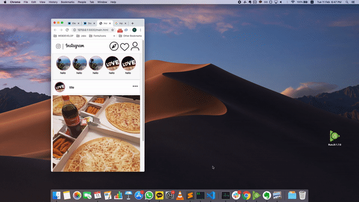

# Westagram

## Goal

- learn DOM

  - document.getElementbyId
  - document.querySelector

- practice Css

  - flex

- practice Javascript (Event Listener)

  - onClick()
  - event.target.value

### Result:

### What I tried

1. Mobile first design
2. Responsive design
